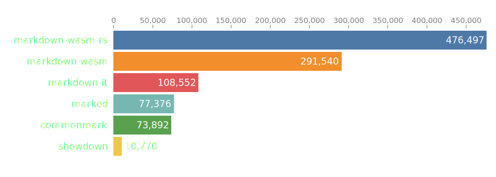
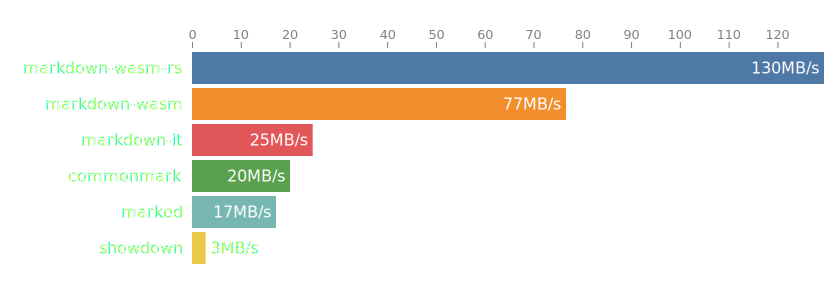
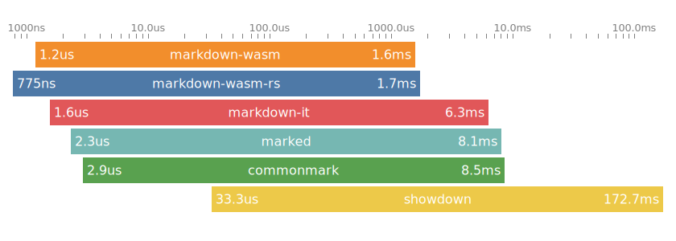

# markdown-wasm

Small Rust + wasm markdown parser.

## Install

Requirements:

- Rust and Cargo
- Node.js (or Bun)
- wasm-pack

Install wasm-pack:

```bash
cargo install wasm-pack
```

## Build and run locally

Build the wasm package:

```bash
npm run build
```

This generates the TS/WASM bindings in `pkg/`.

## Usage

The module comes with one function: parse_markdown(input: string)

```js
import { parse_markdown } from "markdown_wasm";

await init();

const input = `# Hello`
const html = parse_markdown(input);

console.log(html);
```

## Feature Checklist

### Core Markdown

- [x] Headings (`#` to `###` currently parsed)
- [x] Paragraph blocks (including multi-line paragraphs)
- [x] Unordered lists
- [x] Ordered lists
- [x] Fenced code blocks (``` and ~~~)
- [ ] Blockquotes
- [ ] Thematic breaks (`---`, `***`, `___`)
- [ ] Inline links (`[text](url)`)
- [ ] Emphasis (`*italic*`, `**bold**`)
- [ ] Images (``)
- [ ] Inline code spans (`` `code` ``)
- [ ] Autolinks (`<https://example.com>`)
- [ ] Backslash escapes (`\*`, `\[`, etc.)
- [x] HTML escaping in rendered output

### GitHub Flavored Markdown (GFM)

- [ ] Tables
- [ ] Task lists (`- [ ]` / `- [x]`)
- [ ] Strikethrough (`~~text~~`)
- [ ] Autolink literals (`https://example.com`)
- [ ] Footnotes
- [ ] Pipe table alignment (`:---`, `:---:`, `---:`)

### Other Common Markdown Features

- [ ] Setext headings (`Heading` + `===`)
- [ ] Indented code blocks (4-space)
- [ ] Reference-style links (`[text][id]`)

## Benchmarks
Using @rsms/markdown-wasm's bench suite for comparison.
Ran on Window 11 Version 10.0.26200 Build 26200.
Ran on an AMD 7800X3D.


#### Average ops/second

Ops/second represents how many times a library is able to parse markdown and render HTML
during a second, on average across all sample files.



#### Average throughput

Throughput is the average amount of markdown data processed during a second while both parsing
and rendering to HTML. The statistics does not include HTML generated but only bytes of markdown
source text parsed.



#### Min–max parse time

This graph shows the spread between the fastest and slowest parse-and-render operations
for each library. Lower numbers are better.


